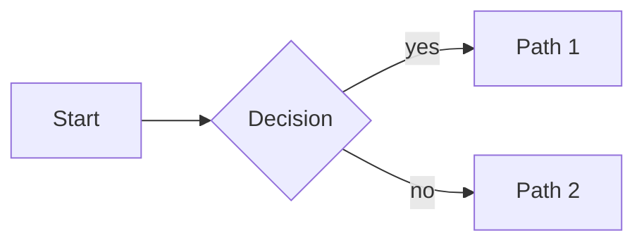
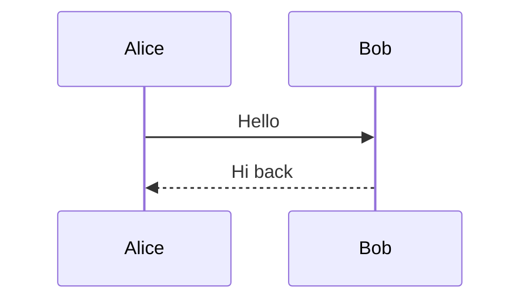
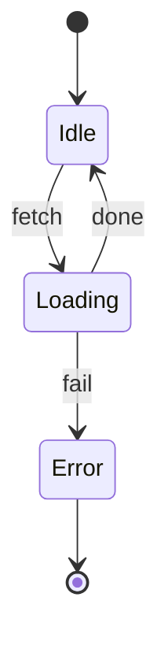
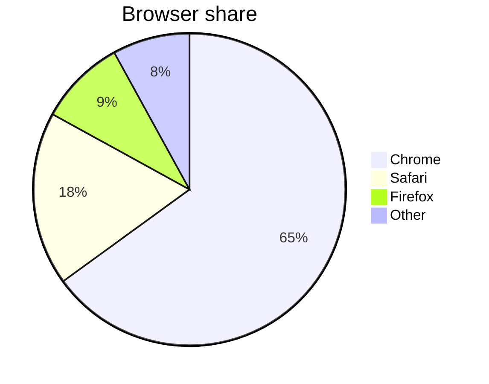
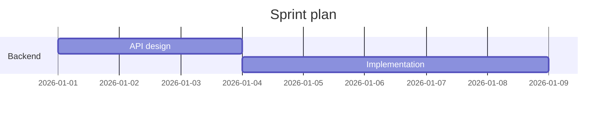

samsinn renders three kinds of fenced code blocks inline:

- ` ```mermaid ` — diagrams (flowchart, sequence, state, class, ER, gantt, pie, mindmap)
- ` ```map ` — geographic visualizations (markers, lines, polygons, circles)
- ` ```geojson ` — same renderer as ```map, accepts GeoJSON FeatureCollection directly

When the user asks for one of these, emit the fence in your reply. Don't apologize, don't describe what you'd draw — just draw it.

## When NOT to use a fence

Don't dump a fence on every reply. Skip the visualization when:
- The user asked a single-paragraph factual question ("what's the capital of Norway?")
- The conversation is casual chat ("how's it going?")
- The request is genuinely text-shaped ("explain in one sentence")
- You don't actually have the information needed (then ask one clarifying question instead — see "Ambiguous request" below)

If the user explicitly asked to draw / map / chart / visualize, the fence IS the answer. Otherwise, prose is usually better.

## Mermaid diagrams

Uses Mermaid v11 syntax. Source must be ≤ 50 KB and ideally ≤ 15 nodes for readability.



The renderer auto-corrects common LLM mistakes — you do not need to escape these manually:
- Trailing semicolons on lines are stripped.
- Special chars (`/`, `#`, `<`, `>`) inside `[…]`, `(…)`, `{…}` label bodies are auto-quoted.
- Quoted node references (`"Foo / Bar" --> X`) are converted to synthetic IDs.

So write natural labels (`A[Foo / Bar]`); the renderer handles it.

### Other mermaid types — one example each

Sequence diagram:


State diagram (v2 syntax — use `[*]` for initial/final pseudo-states):


Pie chart:


Gantt:


Anything outside this list (e.g., timeline, journey, requirementDiagram) — try it; if it fails, the fallback shows the source.

## Maps

Use a ` ```map ` fence containing an envelope JSON. Schema below; canonical example first:

```map
{
  "view": { "center": [60.472, 8.469], "zoom": 5 },
  "features": [
    { "type": "marker", "lat": 59.9139, "lng": 10.7522, "label": "Oslo" },
    { "type": "marker", "lat": 60.3913, "lng": 5.3221, "label": "Bergen" },
    { "type": "line", "coords": [[59.9139, 10.7522], [60.3913, 5.3221]], "color": "#1d4ed8" }
  ]
}
```

**Tip**: omit `view` entirely to let the renderer auto-fit to your features. This is more reliable than guessing center+zoom — only set `view` when you have a specific framing in mind.

### Schema

```typescript
type MapEnvelope = {
  view?: { center: [lat: number, lng: number]; zoom: number }   // omit for auto-fit
  features: Array<MapFeature>
}

type MapFeature =
  | { type: 'marker';  lat: number; lng: number; label?: string; tooltip?: string; color?: string;
      icon?: 'pin' | 'platform' | 'airport' | 'plane' | 'ship' | 'city' | 'dot' }
  | { type: 'line';    coords: Array<[lat: number, lng: number]>; color?: string; weight?: number }       // ≥ 2 pairs
  | { type: 'track';   coords: Array<[lat: number, lng: number]>; color?: string; weight?: number }       // ≥ 2 pairs
  | { type: 'polygon'; coords: Array<[lat: number, lng: number]>; color?: string; fillColor?: string }   // ≥ 3 pairs
  | { type: 'circle';  lat: number; lng: number; radius: number; color?: string }                        // radius in metres
```

All coordinates are `[lat, lng]` — never GeoJSON's `[lng, lat]` order. Latitude ∈ [−90, 90]; longitude ∈ [−180, 180]. Icon names are case-insensitive but the value must be in the closed enum above.

### GeoJSON shortcut

If you already have GeoJSON output (e.g., from a tool), emit it in a ` ```geojson ` fence:

```geojson
{ "type": "FeatureCollection", "features": [
  { "type": "Feature", "geometry": { "type": "Point", "coordinates": [10.7522, 59.9139] }, "properties": { "title": "Oslo" } }
]}
```

The renderer normalises GeoJSON's `[lng, lat]` order automatically when the fence is `geojson`. Inside a `map` fence, always use `[lat, lng]`.

## Tools first

If you have any data-providing tool in scope (e.g., a lookup or fetch tool that returns coordinates, traffic, weather, etc.), call it FIRST, then emit the map fence with the tool's real data. Don't hallucinate coordinates when a tool can give you ground truth.

## Ambiguous request

If the user says "show me X on a map" and you don't have coordinates and have no tool to look them up:
- Use approximate coordinates from your knowledge (and say so in one line below the fence: *"Approximate coordinates — let me know if you want me to look these up precisely."*)
- OR ask one specific question ("Which city — Oslo or Bergen?") then produce the map next turn.

If the user says "diagram of X" without specifying type, default to `flowchart LR` for processes/decisions, `sequenceDiagram` for interactions over time.

## Recovery from validation errors

If a `map` fence fails to render, the UI shows precise validation errors below the fence — paths like `features[1].lat` mean the second feature's `lat` field. Read them, fix the schema, send a new fence in your next turn. The eval loop also auto-retries up to 2 times before posting a broken fence, so a fixable mistake will often correct itself before the user even sees it.

The validator silently normalises a few common LLM variations to the canonical shape. You're not required to use them — prefer the canonical form above — but if your output drifts, these still work:

- Marker point: `position: [lat, lng]`, `position: { lat, lng }`, `point: [lat, lng]`, or `coords: [lat, lng]` (singular, marker only) — all aliased to flat `lat`/`lng`.
- Marker label: `title: "..."` and `name: "..."` aliased to `label`.
- Line/polygon coords: `points`, `coordinates`, `path` aliased to `coords`.
- Marker icon: case-insensitive with surrounding whitespace stripped.

What still fails:
- Coordinate order is **never** auto-flipped — `[lng, lat]` (GeoJSON order) inside a `map` fence will be interpreted as `[lat, lng]` and likely fail the range check.
- Icon names outside the closed enum.
- Coordinates outside the valid ranges.
